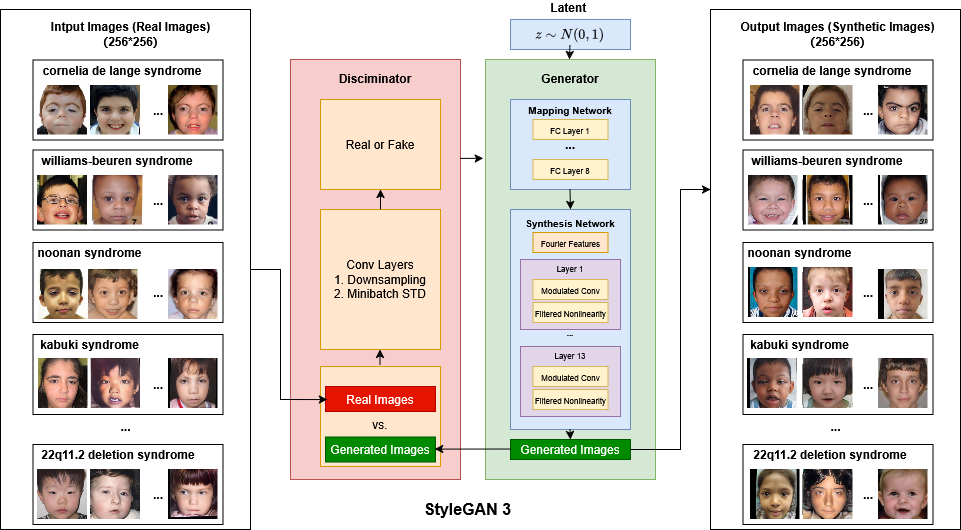
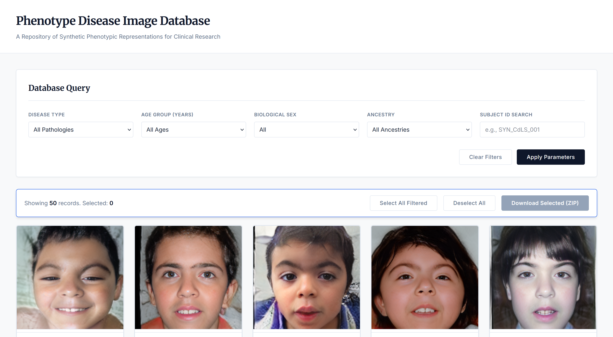

# PDIDB: Phenotype Diseased Image Synthesis Database 

> **A StyleGAN3-based facial image synthesis database for rare genetic disease phenotypes**

[](https://opensource.org/licenses/MIT)
[](https://www.python.org/downloads/)
[](https://pytorch.org/)

---

## 📋 Table of Contents

- [Overview](#overview)
- [Key Features](#key-features)
- [Model Architecture](#model-architecture)
- [Synthetic Image Gallery](#synthetic-image-gallery)
- [Interactive Web Gallery](#interactive-web-gallery)
- [Getting Started](#getting-started)
  - [1. Environment Setup](#1-environment-setup)
  - [2. Data Preprocessing](#2-data-preprocessing)
  - [3. Model Training](#3-model-training)
  - [4. Generate Synthetic Images](#4-generate-synthetic-images)
- [License](#license)

---

## Overview

This repository provides a **class-conditional StyleGAN3 model** trained to generate synthetic facial images representing patients with rare genetic diseases. The generated images capture disease-specific facial phenotype patterns (facial gestalt) and serve multiple purposes in computational biology and medical AI research.

**Primary Use Cases:**
- **Visualization** of disease-specific facial patterns learned from real patient data
- **Generation of synthetic training/evaluation data** for rare disease facial recognition models
- **Educational materials** and clinical teaching resources
- **Data augmentation** for downstream phenotype analysis tasks
- **Privacy-preserving research** by providing synthetic alternatives to real patient images

> ℹ️ **Important Note:** This repository focuses on **synthetic face generation** using StyleGAN3. It does not perform disease diagnosis. All generated images are fully synthetic and do not represent real patients.

---

## Key Features

- ✨ **Class-conditional generation** across multiple rare genetic disease categories
- 🎯 **Alias-free architecture** (StyleGAN3) for improved geometric consistency
- 🖼️ **High-quality 224×224 resolution** synthetic faces compatible with standard computer vision pipelines
- 🎮 **Controllable generation** with latent space manipulation capabilities
- 🌐 **Interactive web gallery** for exploring generated samples by disease type, demographics, and other attributes

---

## Model Architecture

The model is based on **StyleGAN3** with the following key characteristics:

- **Alias-free generator** ensuring better pose consistency and geometric transformations
- **Conditional generation** supporting 10+ disease classes (configurable)
- **Training data**: Preprocessed facial images from genetic disease patient databases
- **Resolution**: 224×224 pixels (can be adjusted)

<p align="center">
  
</p>

---

## Synthetic Image Gallery

We provide sample synthetic faces generated by our trained StyleGAN3 model across different disease categories:

<p align="center">
  
</p>

<p align="center">
  
</p>

---

## Interactive Web Gallery

Explore our complete synthetic image database through an interactive web interface:

**[🌐 Phenotype-Disease Synthetic Image Database](https://hongzhuochen.github.io/Phenotype-Disease-Image-Database-demo/)**

<p align="center">
  
</p>

### Gallery Features:
- **Browse by disease type**: Filter synthetic faces by specific genetic disease categories
- **Demographic filtering**: Search by age range, gender, and ethnicity
- **Metadata annotations**: View generation parameters and conditional attributes
- **Download capability**: Export images for research and educational use
- **High-quality samples**: Access thousands of synthetic faces per disease class

> ⚠️ **Disclaimer**: All images in the gallery are **fully synthetic** and generated by StyleGAN3. They do not represent real patients and are intended solely for research and educational purposes. Please respect ethical guidelines when using these materials.

---

## Getting Started

### 1. Environment Setup

#### Installation

```bash
# Clone the repository
git clone https://github.com/WGLab/PDI-DB.git
cd PDI-DB

# Create a new conda environment
conda create -n PDI-DB python=3.8

# Activate environment
conda activate PDI-DB

# Install PyTorch with CUDA support
pip install torch==2.7.1 torchvision==0.22.1 torchaudio==2.7.1 --index-url https://download.pytorch.org/whl/cu118

# Install other dependencies
pip install click pillow scipy numpy requests tqdm ninja matplotlib imageio
pip install imgui glfw pyopengl imageio-ffmpeg pyspng
```

---

### 2. Data Preprocessing

Before training, you need to prepare your facial phenotype images in the correct format.

#### Data Organization

Organize your raw images in the following structure:

```
raw_data/
├── disease_0/
│   ├── patient_001.jpg
│   ├── patient_002.jpg
│   └── ...
├── disease_1/
│   ├── patient_001.jpg
│   ├── patient_002.jpg
│   └── ...
└── disease_N/
    ├── patient_001.jpg
    └── ...
```

> 📊 **Note: Training Dataset Information**  
> The synthetic images showcased in this repository were generated using a model trained on 2,357 facial images across 11 categories:
> - **Disease images** (10 categories, 1,857 images): Cornelia de Lange Syndrome (447), Williams-Beuren Syndrome (273), Noonan Syndrome (217), Kabuki Syndrome (206), KBG Syndrome (179), Angelman Syndrome (160), Rubinstein-Taybi Syndrome (116), Smith-Magenis Syndrome (102), Nicolaides-Baraitser Syndrome (97), and 22q11.2 Deletion Syndrome (60). All disease images are sourced from the [GestaltMatcher Database (GMDB)](https://db.gestaltmatcher.org/).
> - **Healthy control images** (500 images): Selected from the [FFHQ dataset](https://github.com/NVlabs/ffhq-dataset) with age < 20 years.
>
> You can also train the model on your own custom disease categories and sample sizes by following the data preprocessing steps below.

#### Preprocessing Steps

**Manual Preprocessing:**

1. **Face Alignment**: Align all faces to a standard pose using landmark detection
2. **Resolution**: Resize images to 224×224 pixels
3. **Format**: Convert to PNG or JPG format
4. **Quality Control**: Remove low-quality or ambiguous images

#### Create Dataset ZIP

```bash
python dataset_tool.py \
    --source=raw_data/ \
    --dest=datasets/phenotype_disease_224x224.zip \
    --resolution=224x224
```

#### Dataset Structure

The final dataset should be a ZIP file containing:

```
phenotype_disease_224x224.zip
├── 00000/
│   ├── img00000000.png
│   ├── img00000001.png
│   └── ...
├── 00001/
│   └── ...
└── dataset.json  # Metadata with class labels
```

**Example `dataset.json` format:**

```json
{
  "labels": [
    ["img00000000.png", 0],
    ["img00000001.png", 0],
    ["img00000002.png", 1]
  ]
}
```

Where the second value in each pair is the disease class index (0, 1, 2, ..., N).

---

### 3. Model Training

#### Basic Training Command

Train a class-conditional StyleGAN3 model on your phenotype dataset:

```bash
python train.py \
    --outdir=./training-runs \
    --data=./datasets/phenotype_disease_224x224.zip \
    --cfg=stylegan3-t \
    --gpus=8 \
    --batch=32 \
    --cond=True \
    --gamma=2 \
    --mirror=1 \
    --kimg=5000
```

#### Training Parameters

| Parameter | Description | Recommended Value |
|-----------|-------------|-------------------|
| `--outdir` | Output directory for training results | `./training-runs` |
| `--data` | Path to your preprocessed dataset ZIP | Required |
| `--cfg` | Model configuration (`stylegan3-t`, `stylegan3-r`, `stylegan2`) | `stylegan3-t` |
| `--gpus` | Number of GPUs to use | 1–8 |
| `--batch` | Total batch size across all GPUs | 32 |
| `--cond` | Enable class-conditional generation | `True` |
| `--gamma` | R1 regularization weight | 2–8 |
| `--mirror` | Enable horizontal flipping augmentation | `1` (enabled) |
| `--kimg` | Training duration in thousands of images | 5000 |
| `--snap` | Snapshot interval (in ticks) | 20 |

#### Multi-GPU Training Example

```bash
python train.py \
    --outdir=./training-runs \
    --data=./datasets/phenotype_disease_224x224.zip \
    --cfg=stylegan3-t \
    --gpus=8 \
    --batch=32 \
    --cond=True \
    --gamma=2 \
    --mirror=1 \
    --kimg=5000 \
    --snap=20
```

#### Monitoring Training Progress

Training outputs are saved in timestamped directories:

```
training-runs/
└── 00000-stylegan3-t-phenotype_disease_224x224-gpus8-batch32-gamma2/
    ├── network-snapshot-000000.pkl    # Initial model
    ├── network-snapshot-000100.pkl    # Checkpoint at 100k images
    ├── fakes000000.png                # Sample images at start
    ├── fakes000100.png                # Sample images at 100k
    ├── training_stats.jsonl           # Training metrics
    └── metric-fid50k_full.jsonl       # FID scores (if enabled)
```

**Key files to monitor:**

- `fakes*.png`: Visual quality of generated images
- `training_stats.jsonl`: Loss values and training metrics
- `network-snapshot-*.pkl`: Model checkpoints

---

### 4. Generate Synthetic Images

Once training is complete, use the trained model to generate synthetic phenotype images.

#### Generate Images for a Specific Disease Class

```bash
python gen_images.py \
    --network=./training-runs/00000-stylegan3-t-.../network-snapshot-005000.pkl \
    --outdir=./generated_images \
    --samples=100 \
    --class=0 \
    --trunc=1.0
```

#### Generation Parameters

| Parameter | Description | Example |
|-----------|-------------|---------|
| `--network` | Path to trained model `.pkl` file | `network-snapshot-005000.pkl` |
| `--outdir` | Output directory for generated images | `./generated_images` |
| `--samples` | Number of images to generate | `100` |
| `--class` | Disease class index (0, 1, 2, ...) | `0` |
| `--trunc` | Truncation psi (0.5–1.0 for quality vs diversity) | `1.0` |

#### Adjusting Image Quality and Diversity

The `--trunc` parameter controls the trade-off between quality and diversity:

- **`--trunc=0.5`**: Higher quality, less diversity (more typical faces)
- **`--trunc=0.7`**: Balanced quality and diversity
- **`--trunc=1.0`**: Maximum diversity, lower average quality

**Examples:**

```bash
# High quality, low diversity
python gen_images.py --network=model.pkl --outdir=out_quality --samples=100 --class=0 --trunc=0.5

# Balanced
python gen_images.py --network=model.pkl --outdir=out_balanced --samples=100 --class=0 --trunc=0.7

# High diversity
python gen_images.py --network=model.pkl --outdir=out_diverse --samples=100 --class=0 --trunc=1.0
```

---

## License

This project is licensed under the **MIT License**.

